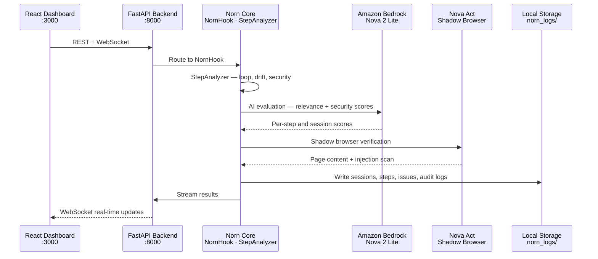
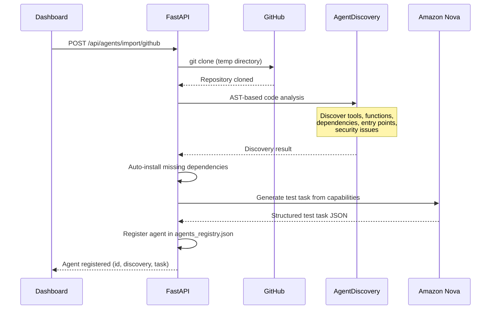
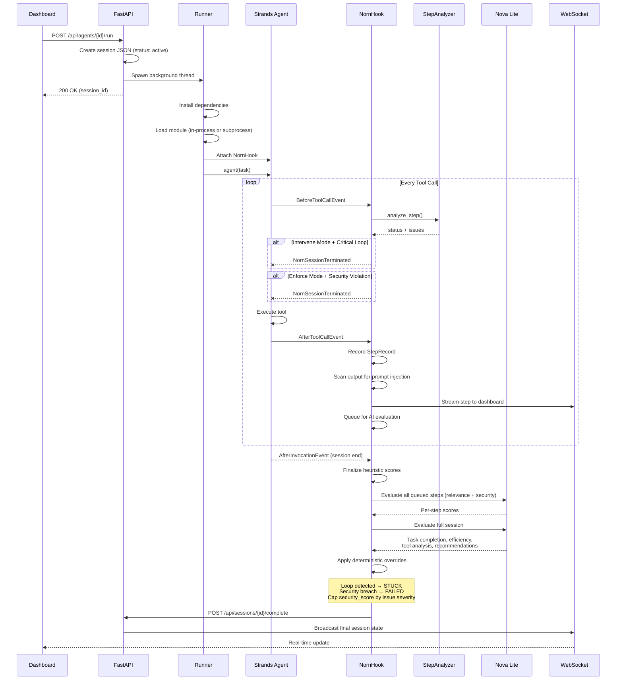
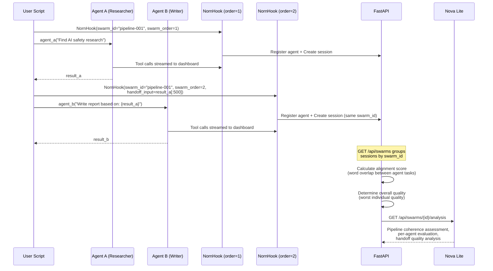
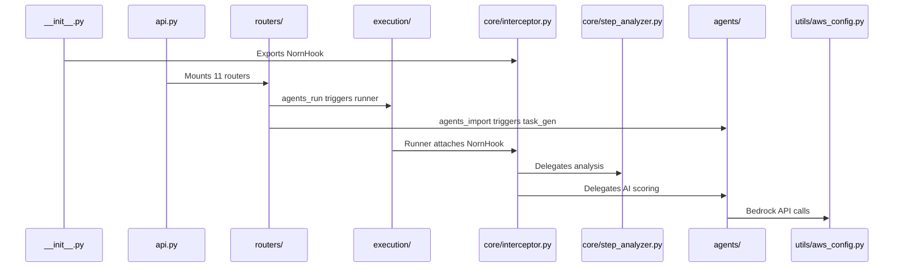
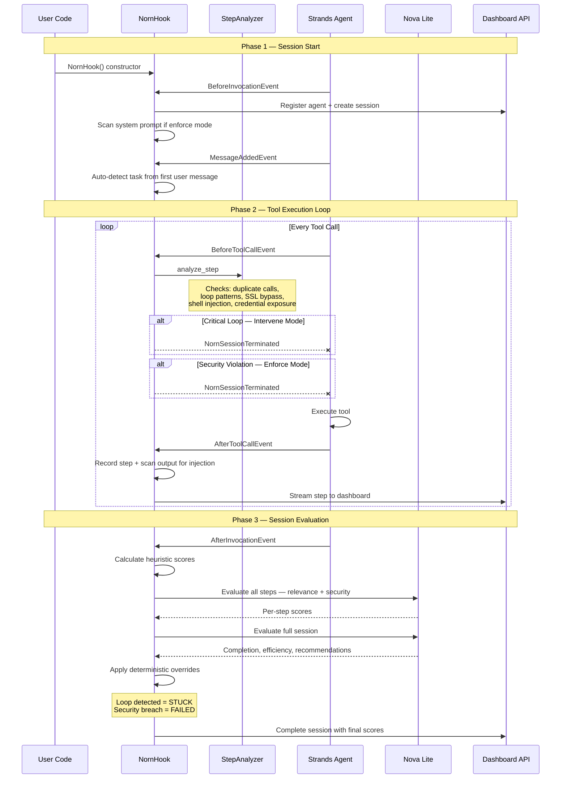
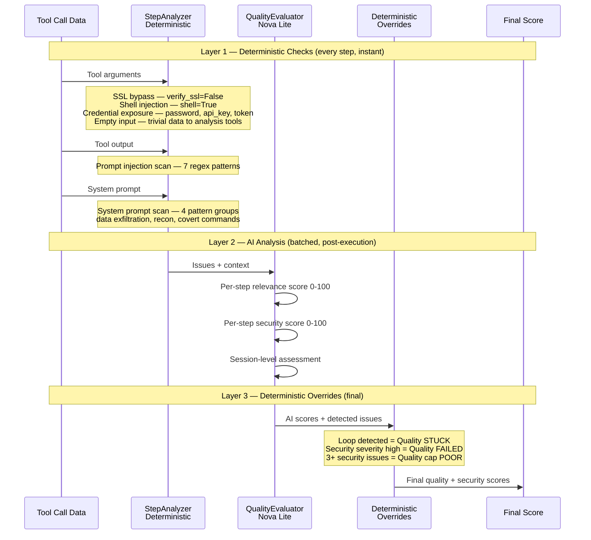
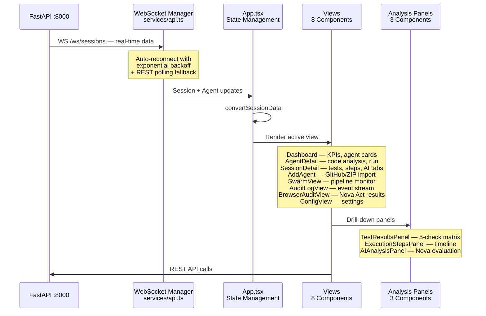

# Norn — Architecture

> Technical reference for the Norn platform internals.

---

## System Overview



---

## Request Flow — Agent Import



---

## Request Flow — Agent Execution



---

## Request Flow — Multi-Agent Swarm



---

## Component Architecture

```
norn/                              Python Package
├── __init__.py                    Exports · Auto-enable
├── api.py                         FastAPI Factory
├── shared.py                      Global State · Locks
├── proxy.py                       MonitoredAgent
│
├── core/                          Monitoring Engine
│   ├── interceptor.py             NornHook — 1,322 LOC
│   ├── step_analyzer.py           Loop · Drift · Security
│   └── audit_logger.py            JSON Logging
│
├── agents/                        AI Analysis
│   ├── quality_evaluator.py       Nova Lite Scoring
│   └── shadow_browser.py          Nova Act Verification
│
├── execution/                     Agent Runner
│   ├── runner.py                  Execution Harness
│   ├── task_gen.py                Task Generation
│   └── discovery.py               Dependency Discovery
│
├── models/
│   └── schemas.py                 Pydantic Models
│
├── routers/                       11 FastAPI Routers
│   ├── agents_import.py           GitHub/ZIP import
│   ├── agents_run.py              Agent execution
│   ├── agents_hook.py             Hook registration
│   ├── agents_registry.py         Agent CRUD
│   ├── sessions.py                Session management
│   ├── swarms.py                  Swarm pipeline API
│   ├── audit.py                   Audit log API
│   ├── config.py                  Configuration API
│   ├── stats.py                   Dashboard statistics
│   └── websocket.py               WebSocket updates
│
├── utils/
│   ├── agent_discovery.py         Deep AST Analysis
│   └── aws_config.py              Bedrock Client
│
└── import_utils/
    ├── file_detection.py          Agent File Heuristics
    └── pyproject.py               pyproject.toml Parsing
```

**Dependency flow:**



---

## Data Flow — NornHook Lifecycle



---

## Security Analysis Pipeline



---

## Dashboard Architecture



**Tech stack:** React 19 + TypeScript + Tailwind CSS + Vite

---

## Storage Layout

```
norn_logs/
├── config.json                    Guard mode, thresholds, feature toggles
├── agents_registry.json           All registered agents
│
├── sessions/
│   └── <session_id>.json          Full session report (one per run)
│
├── steps/
│   └── <YYYYMMDD>.jsonl           Step records (append-only, daily files)
│
├── issues/
│   └── <issue_id>.json            Quality issues
│
├── workspace/
│   ├── git-<ts>-<agent>/          Isolated output for imported agents
│   └── hook-<name>-<ts>/          Isolated output for hook agents
│
└── venvs/                         Cached virtual environments
```

All JSON writes use atomic write (temp file + `os.replace`) to prevent corruption on process kill. Session files use per-session threading locks to prevent TOCTOU race conditions.

---

## Thread Safety Model

| Lock | Scope | Protects |
|---|---|---|
| `_registry_lock` | Global | `agents_registry.json` read/write |
| `_chdir_lock` | Global | `os.chdir` during in-process agent execution |
| `_session_locks` | Per-session | Session JSON read-modify-write (created on demand) |
| `_session_locks_guard` | Global | Guards the `_session_locks` dict itself |
| `_write_lock` | AuditLogger | Step/issue/session log file writes |

All locks are `threading.Lock` instances. Session locks are created lazily via `_session_locks_guard` to avoid pre-allocating locks for sessions that may never be written concurrently.

---

## Key Files Reference

| File | Lines | Purpose |
|---|---|---|
| `norn/__init__.py` | 37 | Package entry — exports `NornHook` and schema types |
| `norn/api.py` | 122 | FastAPI app factory — CORS, global error handler, router mounting, static frontend serving |
| `norn/shared.py` | 167 | Global state: paths, threading locks, WebSocket manager, auth, atomic write, config management |
| `norn/proxy.py` | 99 | `MonitoredAgent` wrapper — drop-in Agent replacement with auto NornHook |
| `norn/core/interceptor.py` | 1,322 | `NornHook` — Strands `HookProvider`, session lifecycle, dashboard streaming, AI evaluation orchestration |
| `norn/core/step_analyzer.py` | 340 | Deterministic loop, drift, and security detection with input diversity analysis |
| `norn/core/audit_logger.py` | 243 | Structured JSON logging with pluggable `LogStore` backend (local files, extensible to S3/DynamoDB) |
| `norn/agents/quality_evaluator.py` | 432 | AI scoring via Amazon Nova Lite — per-step relevance/security + session-level evaluation |
| `norn/agents/shadow_browser.py` | 207 | Nova Act shadow browser verification — phishing, injection, redirect detection |
| `norn/execution/runner.py` | 582 | Agent execution harness — in-process loading with subprocess fallback, dependency installation, workspace isolation |
| `norn/execution/task_gen.py` | 218 | AI-powered test task generation — reads README, tools, system prompt to generate meaningful tasks |
| `norn/execution/discovery.py` | 175 | Lightweight AST-based agent discovery and dependency auto-installation |
| `norn/utils/agent_discovery.py` | 448 | Deep AST code analysis — tools, functions, classes, imports, dependencies, entry points, credential detection |
| `norn/utils/aws_config.py` | 138 | AWS Bedrock client with bearer token + IAM auth, credential masking |
| `norn/models/schemas.py` | 228 | Pydantic models: `SessionReport`, `StepRecord`, `QualityIssue`, `TaskDefinition`, enums |

### Routers

| File | Lines | Endpoints | Auth |
|---|---|---|---|
| `agents_hook.py` | 70 | `POST /api/agents/register` | No |
| `agents_import.py` | 330 | `POST /api/agents/import/{github,zip}` | Yes |
| `agents_registry.py` | 94 | `GET/DELETE /api/agents[/{id}]` | Yes |
| `agents_run.py` | 118 | `POST /api/agents/{id}/run` | Yes |
| `sessions.py` | 382 | `GET/POST/DELETE /api/sessions/...` | Mixed |
| `swarms.py` | 269 | `GET/DELETE /api/swarms[/{id}][/analysis]` | No |
| `audit.py` | 239 | `GET/DELETE /api/audit-logs[/{id}]` | Yes |
| `config.py` | 76 | `GET/PUT /api/config` | Yes |
| `stats.py` | 40 | `GET /api/stats` | Yes |
| `websocket.py` | 117 | `WS /ws/sessions` | Yes |

---

## API Reference

### REST Endpoints

| Method | Path | Auth | Description |
|---|---|---|---|
| `GET` | `/api/health` | No | Health check |
| `GET` | `/api/agents` | Yes | List all registered agents |
| `GET` | `/api/agents/{id}` | Yes | Get agent details |
| `POST` | `/api/agents/import/github` | Yes | Import agent from GitHub URL |
| `POST` | `/api/agents/import/zip` | Yes | Import agent from ZIP upload |
| `POST` | `/api/agents/{id}/run` | Yes | Execute agent with a task |
| `DELETE` | `/api/agents/{id}` | Yes | Delete agent and its temp files |
| `POST` | `/api/agents/register` | No | Register hook agent (SDK internal) |
| `GET` | `/api/sessions` | Yes | List all sessions |
| `GET` | `/api/sessions/{id}` | Yes | Get session detail |
| `POST` | `/api/sessions/ingest` | No | Create/resume session (SDK internal) |
| `POST` | `/api/sessions/{id}/step` | No | Append step (SDK internal) |
| `POST` | `/api/sessions/{id}/complete` | No | Complete session (SDK internal) |
| `DELETE` | `/api/sessions/{id}` | Yes | Delete session |
| `GET` | `/api/swarms` | No | List all swarm pipelines |
| `GET` | `/api/swarms/{id}` | No | Get swarm detail |
| `GET` | `/api/swarms/{id}/analysis` | No | AI-powered pipeline analysis |
| `DELETE` | `/api/swarms/{id}` | No | Delete swarm and its sessions |
| `GET` | `/api/audit-logs` | Yes | Filtered audit event stream |
| `DELETE` | `/api/audit-logs/{id}` | Yes | Delete audit event |
| `GET` | `/api/config` | Yes | Get configuration |
| `PUT` | `/api/config` | Yes | Update configuration |
| `GET` | `/api/stats` | Yes | Dashboard statistics |

### WebSocket

| Path | Auth | Description |
|---|---|---|
| `WS /ws/sessions` | Yes | Real-time session and agent updates (5s refresh cycle, ping/pong keepalive) |

Authentication: `X-API-Key` header or `api_key` query parameter. Set `NORN_API_KEY` in `.env` to enable. When unset, auth is disabled (development mode).

---

## Configuration Reference

### Environment Variables

| Variable | Default | Description |
|---|---|---|
| `AWS_ACCESS_KEY_ID` | — | AWS credentials for Bedrock |
| `AWS_SECRET_ACCESS_KEY` | — | AWS credentials for Bedrock |
| `AWS_DEFAULT_REGION` | `us-east-1` | AWS region |
| `BEDROCK_NOVA_LITE_MODEL` | `us.amazon.nova-2-lite-v1:0` | Bedrock model ID for all AI features |
| `NOVA_ACT_API_KEY` | — | Nova Act API key for shadow browser (optional) |
| `NORN_API_KEY` | — | API authentication key (empty = dev mode, no auth) |
| `NORN_MODE` | `monitor` | Default guard mode: `monitor` / `intervene` / `enforce` |
| `NORN_LOG_DIR` | `norn_logs` | Log directory path |
| `NORN_CORS_ORIGINS` | `http://localhost:5173,...` | Comma-separated allowed CORS origins |

### Dashboard Configuration (`norn_logs/config.json`)

| Setting | Default | Description |
|---|---|---|
| `guard_mode` | `monitor` | Operating mode |
| `max_steps` | `50` | Step limit per session |
| `enable_ai_eval` | `true` | Enable Amazon Nova scoring |
| `enable_shadow_browser` | `false` | Enable Nova Act verification |
| `loop_window` | `5` | Recent steps window for loop detection |
| `loop_threshold` | `3` | Repetitions to trigger loop alert |
| `max_same_tool` | `10` | Max calls per tool before alert |
| `security_score_threshold` | `70` | Security score threshold |
| `relevance_score_threshold` | `30` | Relevance score threshold |
| `auto_intervene_on_loop` | `false` | Auto-stop on loop detection |
| `log_retention_days` | `30` | Auto-cleanup for old log files |
| `audit_max_sessions` | `100` | Max sessions shown in audit view |
