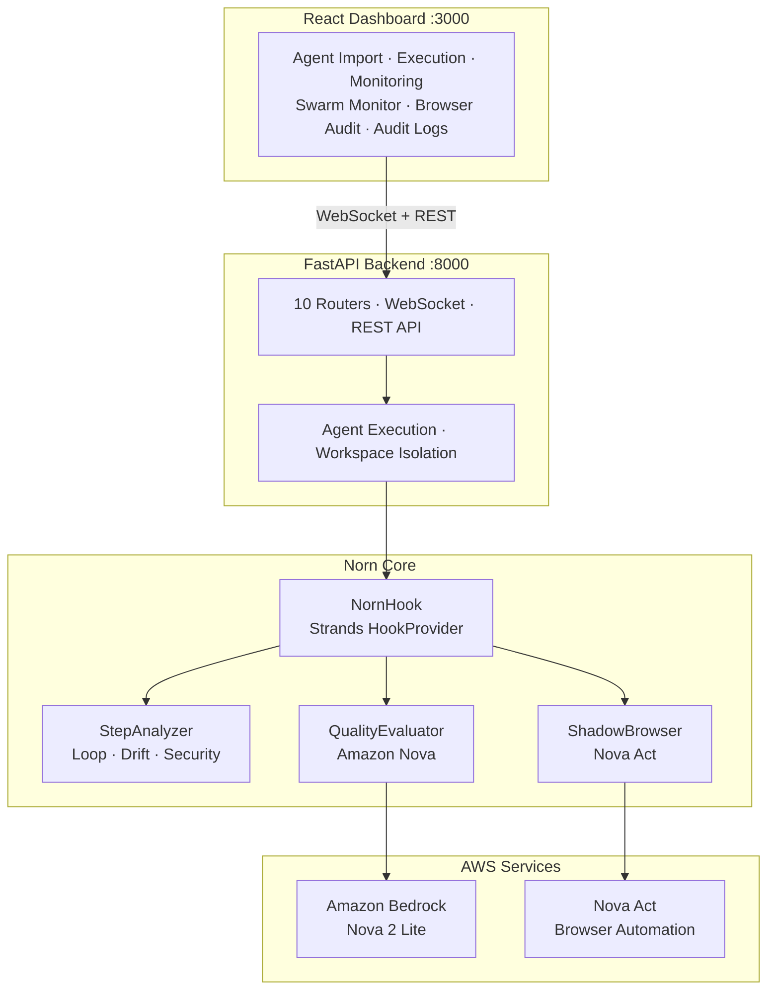

# Norn

> **AI Agent Quality & Security Monitoring Platform**

Real-time monitoring and testing platform for [Strands](https://github.com/strands-agents/sdk-python) AI agents. Import agents from GitHub or ZIP, analyze their code with AST-based static analysis, detect security and quality issues, execute agents in isolated workspaces, and monitor every tool call in real time — including multi-agent swarm pipelines.

[](https://aws.amazon.com/bedrock/nova/)
[](https://github.com/strands-agents/sdk-python)
[](LICENSE)
[](https://www.python.org/)
[](https://react.dev/)
[](https://pypi.org/project/norn-sdk/)

---

## The Problem

AI agents are powerful but unpredictable. In production, they:

- **Get stuck in infinite loops** — repeating the same tool call without progress
- **Drift away from their task** — doing unrelated work instead of what was asked
- **Leak sensitive data** — exposing API keys, credentials, or private information
- **Execute malicious instructions** — prompt injection in tool outputs or system prompts
- **Hallucinate results** — claiming success without actually completing the task
- **In multi-agent pipelines** — silently diverge from the original goal as tasks are handed off between agents

Without observability, these failures go undetected.

---

## The Solution

Norn provides end-to-end observability for AI agent execution:

### 1. Import & Analyze

Import agents from GitHub (with subfolder support) or ZIP files. Norn automatically:

- Runs AST-based static analysis to discover tools, functions, dependencies, and entry points
- Detects missing packages and installs them (PyPI and local)
- Identifies security issues (hardcoded credentials, missing configurations)
- Generates AI-powered test tasks tailored to the agent's actual capabilities using Amazon Nova

### 2. Execute & Monitor

Run agents directly from the dashboard with real-time monitoring:

- Live WebSocket updates stream every tool call as it happens
- Per-step relevance scoring (0–100): is this step helping complete the task?
- Per-step security scoring (0–100): is this step safe?
- Deterministic loop and drift detection with configurable thresholds
- Three guard modes: **Monitor** (observe), **Intervene** (stop on loops), **Enforce** (stop on security violations)

### 3. Workspace Isolation

Each agent run gets its own sandboxed working directory:

- Output files go to `norn_logs/workspace/{session_id}/` — not the project root
- Agents receive the `NORN_WORKSPACE` environment variable pointing to their directory
- Clean separation between runs with no cross-contamination

### 4. Swarm Monitoring

Monitor chains of agents that work together as a pipeline:

- Group sessions by `swarm_id` — see the full pipeline at a glance
- **Alignment score**: measures how closely each agent's task aligns with the first agent's original intent
- Per-agent quality, efficiency, and security scores displayed in pipeline order
- AI-powered pipeline coherence analysis identifies where a chain starts drifting off-goal

### 5. Session Evaluation

After execution completes, Amazon Nova performs deep analysis:

- Task completion assessment with confidence score
- Per-tool usage analysis: was each tool used correctly, unnecessarily, or incorrectly?
- Decision-making pattern observations
- Efficiency explanation (actual steps vs. expected)
- Actionable recommendations for improvement

### 6. Shadow Browser Audit *(optional — requires Nova Act)*

When agents visit URLs, [Nova Act](https://nova.amazon.com/act) runs a shadow browser session to independently verify:

- The page content matches what the agent reported
- No prompt injection payloads are embedded in the page
- No phishing indicators, suspicious redirects, or hidden malicious elements

To enable: `pip install -e ".[browser]"` and set `NOVA_ACT_API_KEY` in your `.env` file.

---

## Quick Start

### Prerequisites

| Requirement | Version | Notes |
|---|---|---|
| Python | 3.10+ | Backend |
| Node.js | 18+ | Dashboard |
| AWS account | — | Amazon Bedrock access for Nova models |

### Installation

```bash
# Clone and install
git clone https://github.com/hashtagemy/norn.git
cd norn
python -m venv .venv && source .venv/bin/activate
pip install -e ".[api]"

# Configure AWS credentials
cp .env.example .env
# Edit .env — add your AWS_ACCESS_KEY_ID, AWS_SECRET_ACCESS_KEY, and AWS_DEFAULT_REGION

# Install dashboard
cd norn-dashboard && npm install && cd ..
```

### Start Norn

```bash
# Terminal 1 — Backend
source .venv/bin/activate
python -m norn.api
# API available at http://localhost:8000

# Terminal 2 — Dashboard
cd norn-dashboard && npm run dev
# Dashboard available at http://localhost:3000
```

### Install via PyPI

To use the Norn SDK (`NornHook`) inside your own projects without the dashboard:

```bash
pip install norn-sdk
```

See [QUICKSTART.md](QUICKSTART.md) for detailed setup instructions.

---

## Integration

Add Norn monitoring to your Strands agent with a single line of code.

### Hook Integration *(recommended)*

```python
from norn import NornHook
from strands import Agent

hook = NornHook(
    norn_url="http://localhost:8000",   # streams to dashboard in real time
    agent_name="My Agent",
)

agent = Agent(tools=[...], hooks=[hook])
agent("Summarize the latest AI research papers")
```

Every tool call is now tracked on the dashboard in real time.

### Zero-Code Integration *(environment variable)*

Add to your shell profile once — every Strands agent you run is automatically monitored:

```bash
# Add to ~/.zshrc or ~/.bashrc
export NORN_AUTO_ENABLE=true
export NORN_URL=http://localhost:8000
export NORN_MODE=monitor   # monitor | intervene | enforce
```

```bash
python your_agent.py   # automatically monitored, no code changes needed
```

### Multi-Agent Swarm

Monitor a pipeline of agents working together. Link them with a shared `swarm_id`:

```python
from datetime import datetime
from norn import NornHook
from strands import Agent

run_id = datetime.now().strftime("%Y%m%d-%H%M%S")

# Agent A — Researcher
hook_a = NornHook(
    norn_url="http://localhost:8000",
    agent_name="Researcher",
    swarm_id=f"my-pipeline-{run_id}",
    swarm_order=1,
)
agent_a = Agent(tools=[...], hooks=[hook_a])
result_a = agent_a("Find recent AI safety research trends")

# Agent B — Writer (receives output from Agent A)
hook_b = NornHook(
    norn_url="http://localhost:8000",
    agent_name="Writer",
    swarm_id=f"my-pipeline-{run_id}",
    swarm_order=2,
    handoff_input=str(result_a)[:500],
)
agent_b = Agent(tools=[...], hooks=[hook_b])
agent_b(f"Write a report based on: {result_a}")
```

Both sessions appear together under **Swarm Monitor** with an alignment score and AI-powered pipeline analysis.

#### NornHook Parameters

| Parameter | Type | Default | Description |
|---|---|---|---|
| `norn_url` | `str` | `None` | Dashboard API URL. If set, steps stream to the dashboard in real time. |
| `agent_name` | `str` | `None` | Human-readable label shown on the dashboard. |
| `mode` | `str` | `"monitor"` | Guard mode: `monitor`, `intervene`, or `enforce`. |
| `max_steps` | `int` | `50` | Maximum steps before intervention (in `intervene` mode). |
| `enable_ai_eval` | `bool` | `True` | Enable Amazon Nova AI evaluation for quality scoring. |
| `session_id` | `str` | `None` | Fixed session ID. If set, steps accumulate across runs on the same dashboard card. |
| `swarm_id` | `str` | `None` | Shared ID to group agents into a pipeline. Must be identical for all agents in a run. |
| `swarm_order` | `int` | `None` | Position in the swarm pipeline (1 = first agent). |
| `handoff_input` | `str` | `None` | Data received from the previous agent — visible on the dashboard for debugging. |
| `loop_window` | `int` | `5` | Number of recent steps to check for loop patterns. |
| `loop_threshold` | `int` | `3` | Repetitions within window that trigger a loop alert. |
| `max_same_tool` | `int` | `10` | Maximum times a single tool can be called before triggering an alert. |

---

## Guard Modes

Norn supports three operating modes, configurable via code, environment variable, or the dashboard UI:

| Mode | Behavior |
|---|---|
| **Monitor** | Observe and record only. All tool calls proceed normally. Issues are logged but never blocked. |
| **Intervene** | Automatically terminates the session when a critical loop is detected (severity >= 8) or the step limit is exceeded. |
| **Enforce** | Terminates the session on any serious security violation (SSL bypass, prompt injection, data exfiltration, credential leak, unauthorized access). Also scans agent system prompts before execution and blocks malicious instructions. |

---

## Amazon Nova Models

Norn uses the Amazon Nova model family for all AI-powered features:

| Feature | Model | Purpose |
|---|---|---|
| Smart Task Generation | Nova 2 Lite | Generates structured, tool-aware test tasks from agent capabilities |
| Per-Step Scoring | Nova 2 Lite | Real-time relevance (0–100) and security (0–100) scoring during execution |
| Session Evaluation | Nova 2 Lite | Post-run analysis: task completion, tool usage, decision patterns, recommendations |
| Swarm Analysis | Nova 2 Lite | Pipeline coherence assessment across multi-agent chains |
| Shadow Browser Audit | Nova Act | Autonomous browser that independently visits URLs and detects prompt injection |

**Model ID (configurable via `.env`):**

```
BEDROCK_NOVA_LITE_MODEL=us.amazon.nova-2-lite-v1:0
```

---

## Dashboard

Modern React dashboard with real-time monitoring capabilities:

| Feature | Description |
|---|---|
| **Agent Management** | Import from GitHub or ZIP, view registered agents, run with one click |
| **Code Analysis** | AST-based discovery of tools, functions, dependencies, and entry points |
| **Smart Task Generation** | AI-generated test tasks based on each agent's actual tools and README |
| **Dependency Management** | Automatic detection and installation of missing packages |
| **Real-Time Monitoring** | WebSocket-based live updates during agent execution |
| **Session History** | Detailed reports for all past executions with drill-down views |
| **Test Results** | Five automated checks: loop detection, task completion, efficiency, security, overall quality |
| **AI Analysis** | Amazon Nova evaluation with tool usage analysis, decision observations, and recommendations |
| **Swarm Monitor** | Multi-agent pipeline view with alignment score, agent ordering, and coherence analysis |
| **Shadow Browser Audit** | Nova Act verification results for web-browsing agents |
| **Audit Logs** | Filterable event stream with severity levels, agent/session filtering |
| **Configuration** | Guard mode, thresholds, and feature toggles adjustable from the UI |

**Tech stack:** React 19 + TypeScript + Tailwind CSS + Vite | FastAPI + Python 3.10+ | WebSocket

---

## Security Features

Norn provides multi-layered security analysis combining deterministic rules and AI evaluation:

### Deterministic Checks *(fast, runs on every step)*
- **SSL bypass detection** — flags `verify_ssl=False` and similar patterns
- **Shell injection detection** — catches `shell=True` and shell metacharacters in commands
- **Credential exposure** — detects sensitive field names (passwords, API keys, tokens) in tool arguments
- **Empty input detection** — flags tools receiving trivially empty data (potential analysis bypass)
- **Prompt injection scanning** — regex-based detection of manipulation patterns in tool outputs
- **System prompt analysis** — scans agent instructions for data exfiltration, reconnaissance, and covert commands

### AI-Powered Analysis *(runs via Amazon Nova)*
- Per-step security scoring with reasoning
- Data exfiltration pattern detection
- Credential leak identification
- Session-level security assessment

### Credential Masking
Sensitive values (`password`, `api_key`, `token`, `secret`, etc.) are automatically redacted to `***REDACTED***` before writing to logs or streaming to the dashboard — including values nested inside dicts and lists.

---

## Quality Levels

| Level | Meaning |
|---|---|
| **EXCELLENT** | Task completed efficiently with no issues |
| **GOOD** | Task completed with minor inefficiencies |
| **POOR** | Task partially completed or significantly inefficient |
| **FAILED** | Task not completed or serious security violation |
| **STUCK** | Infinite loop detected |
| **PENDING** | Evaluation not yet complete |

---

## Architecture



For detailed architecture documentation with component diagrams, data flows, API reference, configuration tables, and project structure, see **[ARCHITECTURE.md](ARCHITECTURE.md)**.

---

## License

Apache 2.0 — See [LICENSE](LICENSE) for details.

---

## Built With

[Strands Agents](https://github.com/strands-agents/sdk-python) |
[Amazon Bedrock](https://aws.amazon.com/bedrock/) |
[Amazon Nova](https://aws.amazon.com/bedrock/nova/) |
[Nova Act](https://nova.amazon.com/act) |
[FastAPI](https://fastapi.tiangolo.com/) |
[React](https://react.dev/) |
[Tailwind CSS](https://tailwindcss.com/) |
[Vite](https://vitejs.dev/)
